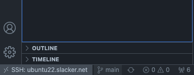
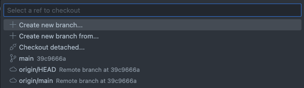
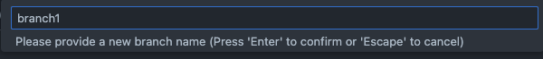
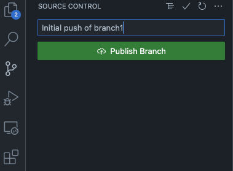
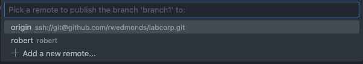
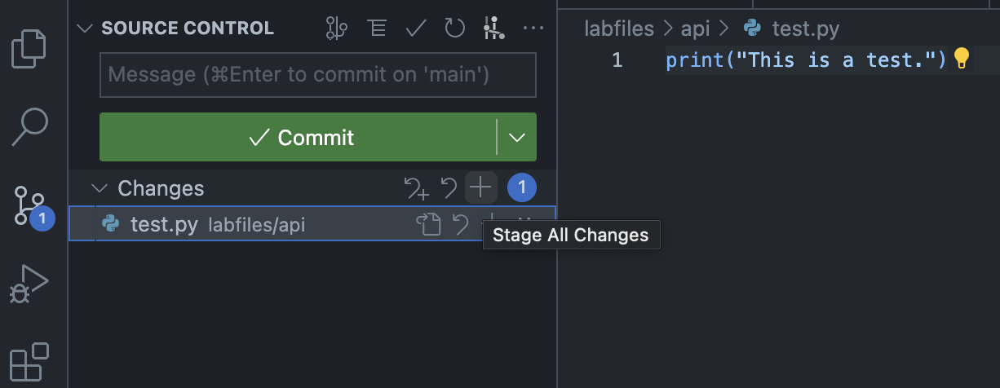
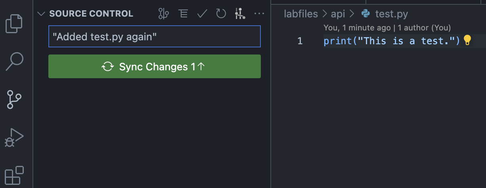

<p style="text-align:center;">
 </br>
</p>

# Table of Contents

[Intro]()</br>
[Getting Started](#getting-started)</br>
&emsp;[Cloning This Repository](#cloning-this-repository)</br>
&emsp;[Software Requirements](#software-requirements)</br>
&emsp;[Docker Container](#docker-container)</br>
&emsp;&emsp;[Permissions](#permissions)</br>
[Git](#git)</br>
&emsp;[Working With Repositories](#working-with-repositories)</br>
&emsp;[Working With Branches](#working-with-branches)</br>
&emsp;[Push Local Changes to Remote Repo](#push-local-changes-to-remote-repo)</br>
[Folder Structure](#folder-structure)</br>
&emsp;[*ansible.cfg* File](#ansiblecfg-file)</br>
&emsp;[*inventory* Folder](#inventory-folder)</br>
&emsp;[*group_vars*](#group_vars)</br>
&emsp;[*host_vars](#host_vars)</br>
&emsp;[*playbooks* Folder](#playbooks-folder)</br>
&emsp;[*requirements.txt* File](#requirementstxt-file)</br>
&emsp;[*scripts* Folder](#scripts-folder)</br>
[Folder Structure After Running AVD](#folder-structure-after-running-avd)</br>
&emsp;[*config_backup* Folder](#config_backup-folder)</br>
&emsp;[*documentation* Folder](#documentation-folder)</br>
&emsp;[*intended* Folder](#intended-folder)</br>
&emsp;&emsp;[*cvaas_configlets.yml*](#cvaas_configletsyml)</br>
&emsp;&emsp;[*cvaas.yml*](#cvaasyml)</br>
&emsp;[Other Files/Folders](#other-filesfolders)</br>
[Running AVD](#running-avd)</br>

---

</br>
</br>

# [DFW]()

This file describes the repository for the Dallas/Ft. Worth (DFW) data center. Below are the requirements for configuring a Linux computer - or Windows computer running the Windows Subsystem for Linux (WSL) - with the required software to run the Ansible AVD (Arista Validated Design) collection to generate configuration files, deploy them to Cloudvision as a Service (CVaaS), generate the associated Change Controls (CC) and then approve and execute them.

# [Getting Started]()

## Cloning This Repository

To work with this repository, the best practice is to clone it to your local machine and make changes there before pushing the changes back to github.com. You should always work within your own branch and not the **main** branch, then use a pull request to pull your changes into the **main** branch. This allows the **main** branch to remain the "live" version. Branches should be considered your devlopment environment.

If you don't have git installed, use the following command (on Ubunt/Debian-based systems) to install it: (may require sudo privileges)

```sh
apt-get install git
```

Once git is installed you can use it clone the repository to you local machine - where you can create a working branch to make changes, test, and push to your branch on github.com - using the following command:

```sh
git clone git@github.com:rwedmonds/labcorp.git
```

---

## Software Requirements

To run this the Ansible playbooks in this repository, you will need to install Ansible, Python, and several packages. Most Linux distributions come with Python preinstalled. Installing the remaining packages can be accomplished using **pip**, Python's package manager. Included in this repository is a *requirements.txt* file with the required software. Install all packages at once with the following command, executed from the same directory where you cloned the repository:

```sh
pip install -r requirements.txt
```

---

## Docker Container

Alternatively, you can run the AVD All In One Docker container that has all the required software installed in the required versions. Refer to [docker.com](https://docs.docker.com/get-docker/) for instructions on installing Docker in your environment, and then use the following command to download and run the container:

```sh
docker run --rm -it -v $(pwd):/home/avd/projects avdteam/avd-all-in-one:latest
```

You should be presented with a prompt similar to the following, letting you know you have successfully deployed and run the container:

```sh
➜  (AVD 🐳) projects git:(main) ✗
```

### Permissions

Because the Docker container is seen by the host operating system as another computer, permissions can be confusing at first. However, they don't need to be.

If you run the Ansible AVD playbook from the Docker container, all the folders created by AVD will be owned by the "avd" user inside that container. This shouldn't be a problem since you shouldn't be changing these files manually, but rather allowing changes to them to be made by Ansible.

Similarly, files that were not created by Ansible AVD or otherwise created from inside the container, won't be writeable (by default) by the Docker container. If you need them to be accessible by the container, use the following command(s) to modify the permissions:

```sh
chmod -<options> <permission level> <file/folder>
```

> Example

```sh
chmod -R 777 inventory
```

> ### WARNING:
>
> #### Do NOT change Linux file permissions unless you know what you are doing. Modifying permissions can lead to software that doesn't work or allow unauthorized users access to your files

</br>

# [Git]()

## Working With Repositories

[Help page](https://docs.github.com/en)

To use your repository remotely, first make sure your public SSH key is in Github

- Go to Settings > SSH and GPG keys (on the left)
- Select New GPG key
- Give it a name and paste the key into the text box

> Your public key is usually located in your home directory, under a hidden directory called *.ssh*. You can view all files and directories using the following command:

```sh
ls -a
# OR, in list format
ls -la
```

> If you don't have a *.ssh* directory, you can create it and a public key with the following command:

```sh
ssh-keygen
```

>View the contents of your public key using a text editor, or at the command line with the following command:

```sh
cat ./.ssh/id_rsa.pub
```

## Working With Branches

> ### Before creating a new branch, do a **git pull** of the main branch

```sh
git checkout main # If not already on the main branch
git pull
```

### Create a new branch named "branch1" in the remote repo (Command line)

```sh
git checkout -b branch1
```

### Create a new branch named "branch1" in the remote repo (VS Code)

</br>

</br>
> Click at the bottom of VS Code where it says "main" and a popup will appear at the top with options for working with branches

</br>

> Click "Create a new branch..." and give it a name

</br>

### Check out branch1 so you can work in it without affecting the main branch (Command line)

```sh
git checkout branch1
```

### Check out branch1 so you can work in it without affecting the main branch (VS Code)

> Select the branch at the bottom of VS Code just like when creating it

### View all branches, with the current branch indicated (with *)

```sh
git branch -a

  main
* branch1
  remotes/origin/HEAD -> origin/main
  remotes/origin/main
  remotes/origin/robert
```

### View the status of the branch you're working in

```sh
git status

On branch branch1
Your branch is up to date with 'origin/branch1'.

Changes not staged for commit:
  (use "git add <file>..." to update what will be committed)
  (use "git restore <file>..." to discard changes in working directory)
        modified:   inventory/group_vars/DC1_TENANTS_NETWORKS/DC1_TENANTS_NETWORKS.yml

no changes added to commit (use "git add" and/or "git commit -a")
```

### Restore the previous version of a file

```sh
git restore inventory/group_vars/DC1_TENANTS_NETWORKS/DC1_TENANTS_NETWORKS.yml
```

### Stage the local directory in preparation for pushing to the remote

```sh
git add .
```

### Commit changes

```sh
git commit -m "Comment here."
```

### Push local changes to remote branch on GitHub

```sh
git push -u origin branch1
```

</br>

</br>

### Merge branch1 into main branch

```sh
git checkout main
git merge branch1
git push
```

> This can also be done at github.com, making it easier to review, comment, and finally merge

## Push Local Changes to Remote Repo

First, sync changes in VS Code to local repo (Click the + button and commit)



Then, at command line

```sh
git push -u origin main
```

OR, in VS Code, use the Sync Changes button



If the file is created remotely, i.e. on github.com, do a pull

```sh
git pull
```

### Check which remote repo you're connected to

```sh
git remote -v
```

> Example

```sh
origin  git@github.com:rwedmonds/L5Labs.git (fetch)
origin  git@github.com:rwedmonds/L5Labs.git (push)
```

> OR

```sh
git config -l

filter.lfs.clean=git-lfs clean -- %f
filter.lfs.smudge=git-lfs smudge -- %f
filter.lfs.process=git-lfs filter-process
filter.lfs.required=true
user.name=arista
user.email=atd-help@arista.com
core.repositoryformatversion=0
core.filemode=true
core.bare=false
core.logallrefupdates=true
remote.origin.url=git@github.com:rwedmonds/L5Labs.git
remote.origin.fetch=+refs/heads/*:refs/remotes/origin/*
branch.main.remote=origin
branch.main.merge=refs/heads/main
```

# [Folder Structure]()

The following is a representation of the relevant parts of the folder structure in this repository, followed by brief descriptions.

```sh
.
├── ansible.cfg
├── inventory
│   ├── group_vars
│   │   ├── DFW
│   │   ├── DFW_DR_FABRIC
│   │   ├── DFW_DR_SERVERS
│   │   ├── DFW_PROD_FABRIC
│   │   ├── DFW_PROD_SERVERS
│   │   ├── EoR_DFW_DR
│   │   └── EoR_DFW_Prod
│   ├── host_vars
├── playbooks
├── requirements.txt
├── scripts

```

## *ansible.cfg* File

This file contains variables used by Ansible in the execution of your playbooks. For example, the line **inventory =./inventory/inventory.yml** tells Ansible where to find your inventory file. You can override this setting by using the command line option **-i <path-to-inventory-file>**.

## *inventory* Folder

The *inventory* folder contains the inventory file and most of the files used to generate configurations used by CVaaS to configure devices. It has several subfolders, described below. It also contains the inventory file, called *inventory.yml*.

### *group_vars*

This is where you store variables that are assigned to groups of devices. Each folder below this one describes a group of devices and the YAML files in them contain configuration information used to generate configuration files.

### *host_vars*

Files stored here apply to individual hosts. Each folder below this one applies only to a single host, and the folder names should mirror the name of the host in the inventory.yml file.

## *playbooks* Folder

Your playbooks are stored here. Ansible playbooks describe the steps to deploy the fabric. The general steps are called "plays," each of which consists of tasks. The play also defines the group on which the play will be executed. Plays and tasks can be assigned "tags" which can help in limiting the scope of the playbook when executed. For example, if you apply the tag "build" to certain plays and use that tag when executing the playbook, only the tasks with that tag will be executed.

> Example

```sh
ansible-playbook playbooks/dfw-fabric-deploy-cvp.yml --tags build
```

## *requirements.txt* File

This file is used to install the required packages and libraries to implement AVD. It is executed using the following command:

```sh
pip install -r requirements.txt
```

## *scripts* Folder

Scripts that help generate content or for any other purpose are stored here.

# [Folder Structure After Running AVD]()

AVD automatically generates files and folders containging structured and unstructed configuration files, configlets and container structure information for CVaaS, and documentation at both the fabric and device levels. Upon successful execution of the "deploy" playbook, your folder structure will look very similar to the following:

```sh
.
├── ansible.cfg
├── inventory
│   ├── config_backup
│   ├── documentation
│   │   ├── devices
│   │   └── fabric
│   ├── group_vars
│   │   ├── DFW
│   │   ├── DFW_DR_FABRIC
│   │   ├── DFW_DR_SERVERS
│   │   ├── DFW_PROD_FABRIC
│   │   ├── DFW_PROD_SERVERS
│   │   ├── EoR_DFW_DR
│   │   └── EoR_DFW_Prod
│   ├── host_vars
│   ├── intended
│   │   ├── configs
│   │   └── structured_configs
│   │       └── cvp
│   ├── reports
│   └── snapshots
├── playbooks
├── requirements.txt
├── scripts

```

## *config_backup* Folder

This folder will probably always remain empty. It is used by the *eos_config_deploy_eapi* role, which deploys configurations directly to devices, rather than via CVaaS. Therefore in a CVaaS implemenation it is not used.

## *documentation* Folder

As the name implies, this is where the documentation generated by AVD is stored. The two subfolders, *devices* and *fabric* store their respective portions of the documentation in markdown format.

## *intended* Folder

This is where the structured (YAML) and unstructure (text) configuration files are stored. The *cvp* folder also contains two files, *cvaas_configlets.yml* and *cvaas.yml*.

### *cvaas_configlets.yml*

This file contains all the configlets that will be pushed to CVaaS. It is not in a human-friendly format, so the information in these files can be view in the *.cfg* files in *intended/configs*.

### *cvaas.yml*

This file contains information on the container and device hierarchy that will be generated or mirrored in CVaaS.

## Other Files/Folders

The other files and folders you may find here, such as this *Readme.md* file, aren't necessary for the operation of AVD, but aid in the general operation of this repository. For example, the *.gitignore* file tells git which files and folders on your local machine should be ignored, i.e. not pushed to github.com during your push operations.

# [Running AVD]()

For the most part the playbook with which you will be interacting is the *playbooks/dfw-fabric-deploy-cvp.yml* playbook. This playbook has the instructions to generated configurations and documentation as well as pushing configlets to CVaaS and generating the tasks used in your CC. When building new fabrics/devices you should run the playbook with the **build** tag, which will not push the configuration to CVaaS. Once you are comfortable with the output and are ready to deploy to CVaaS, simple remove the **build** tag and rerun the playbook.

> Commands

```sh
# Run the playbook in "build" mode
ansible-playbook playbooks/dfw-fabric-deploy-cvp.yml --tags build

# Run the playbook in "provision" mode
ansible-playbook playbooks/dfw-fabric-deploy-cvp.yml
```

==highlight==
